# Хэш-таблицы

## Цель работы
1. Исследовать различные хэш-функции на достоинства и недостатки для кодирования объектов в хэш-таблице.
2. Изучить способы оптимизации программы методами: ассэмблерной вставки, ассэмблерного варината функции и SIMD оптимизации.

## О структуре
Хэш-таблица - массив списков, где каждому значению хэша соотвествует отдельный список, в котором хранятся значения захэшированных элементов. Чем меньше размер списков, тем меньше времени будет затраченно на поиски элемента в структуре. Количество элементов в списке зависит от выбранной функции хэширования.
В моей структуре так же хранятся текущее и максимально возможное количество элементов в таблице и указатель на хэш-функцию

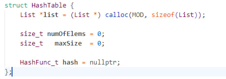

## Ход работы 
Основопологающей частью хэш-таблицы являеется хэш-функция, поэтому давайте проведём анализ следующих функций:
1. **DumbHash** - возвращает всегда 1.

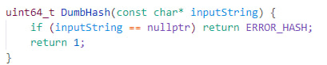

2. **FirstByteHash** - возвращает ASCII код первого символа строки.

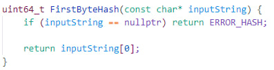

3. **StrLenHash** - возвращает длину строки.

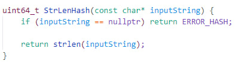

4. **SumHash** - возвращает сумму всех ASCII кодов символов строки.

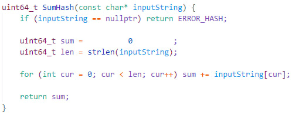

5. **RolHash** - циклический сдвиг хеша влево и xor со значением элемента ключа.

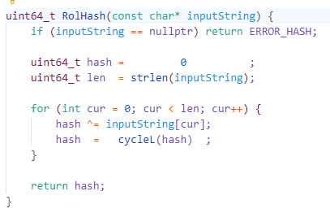

6. **RorHash** - циклический сдвиг хеша вправо и xor со значением элемента 
ключа.

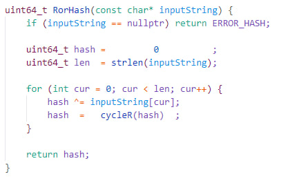

7. **GnuHash** - циклический сдвиг хеша вправо и xor со значением элемента ключа.

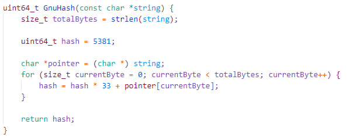

Текст взят из [Hamlet.txt](in/input.txt), все повторяющиеся слова не учитываются.

## Общая Диаграма

## DumbHash
В данной хэш-функции все слова помещены в один список. Хэш-функция не несёт в себе никакого интереса.
- Максимальный размер: 1485
- Среднее квадратичное размеров списка: 46.7739
## FirstByteHash
В отличии от предыдущей функции имеется хотя бы какое-то разбиение текста, но в 
небольшом диапазоне.

- Максимальный размер: 150
- Среднее квадратичное размеров списка: 9.344

## StrLenHash
Кажется, что эта функция будет даже менее эфективна, чем предыдущая, так как слова длиной более 50 букв встречаются в речи крайне редко

- Максимальный размер: 307
- Среднее квадратичное размеров списка: 17.3813

## SumHash

Эта функция уже в разы лучше, чем предыдущие, но всё ещё не идеальна.

- Максимальный размер: 13
- Среднее квадратичное размеров списка: 1.9707

## RolHash

- Максимальный размер: 8
- Среднее квадратичное размеров списка: 1.31105

## RorHash

- Максимальный размер: 9
- Среднее квадратичное размеров списка: 1.69377

## GnuHash

- Максимальный размер: 6
- Среднее квадратичное размеров списка: 1.17443

## Вывод

Из всех предложенных функции, лучше всего себя показали RolHash, RorHash и, самая оптимальная, GnuHash.

## Оптимизации

В своей работе, я хочу оптимизировать процесса поиска слова в построенной хэш-таблице. Для этого будем запускать функцию поиска слова много раз, чтобы 
выявить "узкие" места конкретно этого процесса.

Для начала измерим скорость исполнения без оптимизаций:  
**227.6 ± 16.7мс**

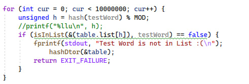

Profiler встроенный в Visual Studio помог мне найти эти узкие места.
После тестирования я получил следующие результаты:

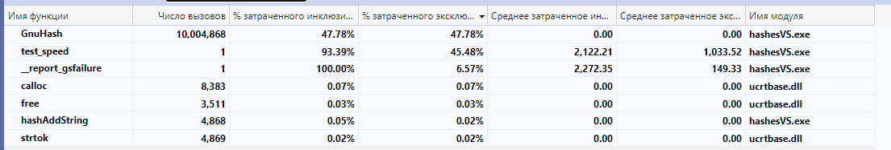

Данные в таблице отсортированны по процентному использованию времени ЦП без учёта вызываемых функций.
Заметим, что основной проблемой является функция подсчёта хэша GnuHash. Перепишу её, используя MASM 64 bit.

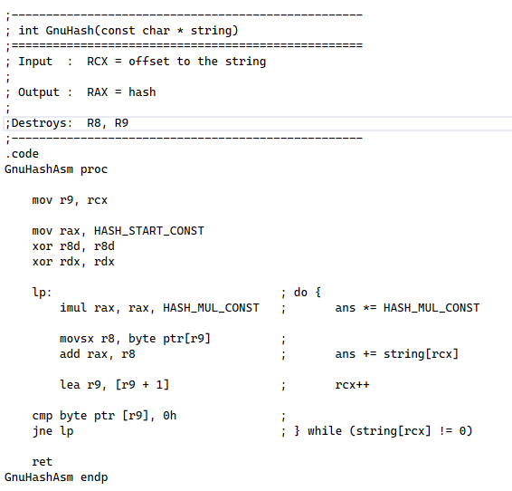

|  Оптимизация | Время работы вызовов (мс) | Относительное ускорение |
|---|---|---|
| Отсутствует | 240 ± 8.7 | 1x |
| ASM версия | 210 ± 6.7 | 1.14x |

Даже после этой оптимизации хэш-функция остаётся самым узким местом, причем она занимает около 50% времени цп.
Однако мне все равно стало интересно, возможно ли ускорить программу, преписав функцию strcmp фссэмблерной вставкой. Однако тут возникла проблема. Visual Studio поддерживает ассэмблерную вставку только для 32 битной версии компилятора, а переход на это версию замедлит мою программу, но в научных целях стоит попробовать:

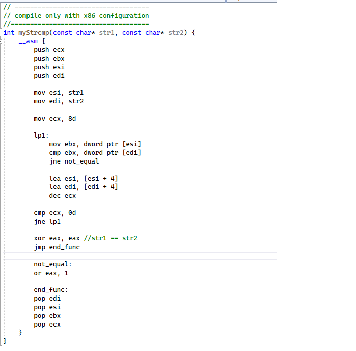

|  Особенности сборки | Время работы вызовов (мс) |
|---|---|
| x64 | 240 ± 8.7 |
| x86 | 402 ± 10.6 |
| x86 + strcmpAsm|  613 ± 15.3 |

Как видно, мало того, что переход от 64 бит к 32-ум сильно замедлил прогу, так ещё и сама оптимизация не оказалась успешной.
Вернёмся к x64.
Самое узкое место остаётся взятие хэша. Следовательно, нужно его попробовать оптимизировать ещё сильнее. В этот раз изменения будут болле радикальными. Я напишу CRC32, а потом оптимизирую его с помощью SIMD операций.

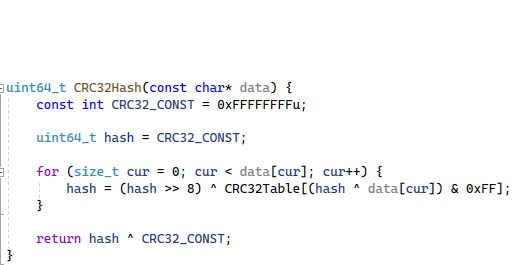

Версия с SIMD.

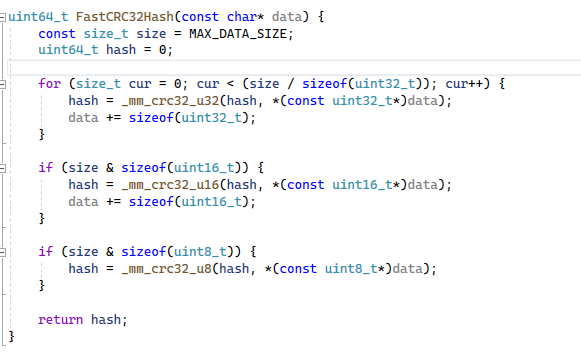

|  Особенности сборки | Время работы вызовов (мс) |
|---|---|
| GnuHash | 260 ± 8.7 |
| GnuHashAsm | 220 ± 6.7 |
| Crc32Hash | 220 ± 7.2 |
| FastCrc32Hash| 160 ± 5.4 |

## **Итоговый прирост - 38%.**

## Выводы

1. Нужно с умом выбирать таблицы хэш-функцию для таблиц.
2. Ассэмблерная вставка не всегда способствует оптимизации кода, иногда она может и замедлить.
3. Очень важно находить узкие места в программе, так как оптимизация в других местах, особо не повлияет на результат.
4. Отдельный пункт хочу выделять для SIMD операции, так как распараллеливание процессов в разы ускоряет программу.
5. К моему удивлению, функция переписанная на MASM64 смогла не слабо оптимизировать функцию. 
