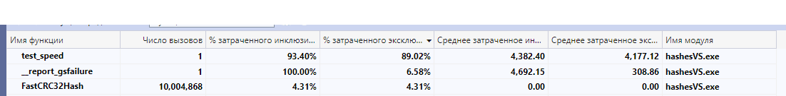

# Хеш-таблицы


## Цель работы
1. Исследовать различные хеш-функции на достоинства и недостатки для кодирования объектов в хеш-таблице.
2. Изучить способы оптимизации программы методами: ассемблерной вставки, ассемблерного варината функции и SIMD операциями.

## О структуре
Хеш-таблица - массив списков, где каждому значению хеша соотвествует отдельный список, в котором хранятся значения захешированных элементов. Чем меньше размер списков, тем меньше времени будет затраченно на поиски элемента в структуре. Количество элементов в списке зависит от выбранной функции хеширования и размера самой таблицы. У меня размер таблицы составляет 1007 элементов.

В моей структуре так же хранятся текущее и максимально возможное количество элементов в таблице и указатель на хеш-функцию

```cpp
struct HashTable {
    List *list = (List *) calloc(MOD, sizeof(List));

    size_t numOfElems = 0;
    size_t   maxSize  = 0;

    HashFunc_t hash = nullptr;
};
```

## Ход работы 
Основопологающей частью хеш-таблицы являеется хеш-функция, поэтому давайте проведём анализ следующих функций:
1. **DumbHash** - возвращает всегда 1.

```cpp
uint64_t DumbHash(const char* inputString) {
    if (inputString == nullptr) return ERROR_HASH;
    return 1;
}
```

2. **FirstByteHash** - возвращает ASCII код первого символа строки.

```cpp
uint64_t FirstElemHash(const char* inputString) {
    if (inputString == nullptr) return ERROR_HASH;

    return inputString[0];
}
```

3. **StrLenHash** - возвращает длину строки.

```cpp
uint64_t StrLenHash(const char* inputString) {
    if (inputString == nullptr) return ERROR_HASH;

    return strlen(inputString);
}
```

4. **SumHash** - возвращает сумму всех ASCII кодов символов строки.

```cpp
uint64_t SumHash(const char* inputString) {
    if (inputString == nullptr) return ERROR_HASH;

    uint64_t sum =          0         ;
    uint64_t len = strlen(inputString);

    for (int cur = 0; cur < len; cur++) sum += inputString[cur];

    return sum;
}
```

5. **RolHash** - циклический сдвиг хеша влево и xor со значением элемента ключа.

```cpp
uint64_t RolHash(const char* inputString) {
    if (inputString == nullptr) return ERROR_HASH;

    uint64_t hash =         0          ;
    uint64_t len  = strlen(inputString);

    for (int cur = 0; cur < len; cur++) {
        hash ^= inputString[cur];
        hash  =   cycleL(hash)  ;
    }

    return hash;
}
```

6. **RorHash** - циклический сдвиг хеша вправо и xor со значением элемента 
ключа.

```cpp
uint64_t RorHash(const char* inputString) {
    if (inputString == nullptr) return ERROR_HASH;

    uint64_t hash =         0          ;
    uint64_t len  = strlen(inputString);

    for (int cur = 0; cur < len; cur++) {
        hash ^= inputString[cur];
        hash  =   cycleR(hash)  ;
    }

    return hash;
}
```

7. **GnuHash**

```cpp
uint64_t GnuHash(const char *inputString) {
    if (inputString == nullptr) return ERROR_HASH;

    size_t totalBytes = strlen(string);

    uint64_t hash = 5381;

    char *pointer = (char *) string;
    for (size_t currentByte = 0; currentByte < totalBytes; currentByte++) {
        hash = hash * 33 + pointer[currentByte];
    }

    return hash;
}
```

Текст взят из [Hamlet.txt](in/input.txt), все повторяющиеся слова не учитываются.

## Общая Диаграма заполненности списков


## DumbHash
При использовании данной хеш-функции все слова были помещены в один список.
- Максимальный размер: 1485
- Среднее квадратичное размеров списка: 46.7739
## FirstByteHash
В отличии от предыдущей функции имеется хотя бы какое-то разбиение текста, но в 
небольшом диапазоне.


- Максимальный размер: 150
- Среднее квадратичное размеров списка: 9.344


## StrLenHash
Кажется, что эта функция будет даже менее эфективна, чем предыдущая, так как слова длиной более 50 букв встречаются в речи крайне редко


- Максимальный размер: 307
- Среднее квадратичное размеров списка: 17.3813

## SumHash

Эта функция уже в разы лучше, чем предыдущие, но всё ещё не идеальна.


- Максимальный размер: 13
- Среднее квадратичное размеров списка: 1.9707

## RolHash


- Максимальный размер: 8
- Среднее квадратичное размеров списка: 1.31105

## RorHash


- Максимальный размер: 9
- Среднее квадратичное размеров списка: 1.69377

## GnuHash


- Максимальный размер: 6
- Среднее квадратичное размеров списка: 1.17443

## Вывод

Из всех предложенных функции, лучше всего себя показали RolHash, RorHash и, самая оптимальная, GnuHash.
Функции: DumbHash, FirstByteHash, StrLenHash - не оптимальны.

## Оптимизации

В своей работе, я хочу оптимизировать процесса поиска слова в построенной хеш-таблице. Для этого будем запускать функцию поиска слова много раз, чтобы 
выявить "узкие" места конкретно этого процесса.

Для начала измерим скорость исполнения без оптимизаций:  
**227.6 ± 16.7мс**


```cpp
for (int cur = 0; cur < 10000000; cur++) {
    char *curWord = words.array[cur % words.numOfWords];
    unsigned h = hash(curWord) % MOD;
    if (isInList(&(table.list[h]), curWord) == false) {
        fprintf(stdout, "TestWord is not in List :(\n");
        hashDtor(&table);
        return EXIT_FAILURE;
    }
}
```

Profiler встроенный в Visual Studio помог мне найти эти узкие места.
После тестирования я получил следующие результаты:


Данные в таблице отсортированны по процентному использованию времени ЦП без учёта вызываемых функций.
Заметим, что основной проблемой является функция подсчёта хеша GnuHash. Перепишу её, используя MASM 64 bit.

```asm
;---------------------------------------------------
; int GnuHash(const char * string)
;===================================================
; Input  :  RCX = offset to the string
;
; Output :  RAX = hash
;
;Destroys:  R8, R9
;---------------------------------------------------
.code
GnuHashAsm proc 

	mov r9, rcx

	mov rax, HASH_START_CONST
	xor r8d, r8d
	xor rdx, rdx

    lp:									; do {
		imul rax, rax, HASH_MUL_CONST	;		ans *= HASH_MUL_CONST

		movsx r8, byte ptr[r9]			;
		add rax, r8 					;		ans += string[rcx]

		lea r9, [r9 + 1]				;		rcx++

	cmp byte ptr [r9], 0h				;	
	jne lp								; } while (string[rcx] != 0)
	
	ret
GnuHashAsm endp
```

|  Оптимизация | Время работы вызовов (мс) | Относительное ускорение |
|---|---|---|
| Отсутствует | 240 ± 8.7 | 1x |
| ASM версия | 210 ± 6.7 | 1.14x |

Даже после этой оптимизации хеш-функция остаётся самым узким местом, причем она занимает около 50% времени цп.
Однако мне все равно стало интересно, возможно ли ускорить программу, преписав функцию strcmp фссэмблерной вставкой. Однако тут возникла проблема. Visual Studio поддерживает ассемблерную вставку только для 32 битной версии компилятора, а переход на это версию замедлит мою программу, но в научных целях стоит попробовать:

```cpp
// -----------------------------------
// compile only with x86 configuration
//====================================
int myStrcmp(const char* str1, const char* str2) {
	__asm {
		push ecx
		push ebx
		push esi
		push edi

		mov esi, str1
		mov edi, str2
		
		mov ecx, 8d
		
		lp1:
			mov ebx, dword ptr [esi]
			cmp ebx, dword ptr [edi]
			jne not_equal

			lea esi, [esi + 4]
			lea edi, [edi + 4]
			lea ecx, [ecx - 1]

		cmp ecx, 0d
		jne lp1
		
		xor eax, eax //str1 == str2
		jmp end_func
		
		not_equal:
		or eax, 1
		
		end_func:
		pop edi
		pop esi
		pop ebx
		pop ecx
	}
}
```

|  Особенности сборки | Время работы вызовов (мс) |
|---|---|
| x64 | 240 ± 8.7 |
| x86 | 402 ± 10.6 |
| x86 + strcmpAsm|  613 ± 15.3 |

Как видно, мало того, что переход от 64 бит к 32-ум сильно замедлил прогу, так ещё и сама оптимизация не оказалась успешной.

Вернёмся к x64.
Самое узкое место остаётся взятие хеша. Следовательно, нужно его попробовать оптимизировать ещё сильнее. В этот раз изменения будут болле радикальными. Я напишу CRC32, а потом оптимизирую его с помощью SIMD операций.

```cpp
uint64_t CRC32Hash(const char* inputString) {
	if (inputString == nullptr) return ERROR_HASH;

	const int CRC32_CONST = 0xFFFFFFFFu;

	uint64_t hash = CRC32_CONST;

	for (size_t cur = 0; cur < inputString[cur]; cur++) {
		hash = (hash >> 8) ^ CRC32Table[(hash ^ inputString[cur]) & 0xFF];
	}

	return hash ^ CRC32_CONST;
}
```

Версия с SIMD:

```cpp
uint64_t FastCRC32Hash(const char* inputString) {
	if (inputString == nullptr) return ERROR_HASH;

	const size_t size = MAX_DATA_SIZE;
	uint64_t hash = 0;

	for (size_t cur = 0; cur < (size / sizeof(uint32_t)); cur++) {
		hash = _mm_crc32_u32(hash, *(const uint32_t*) inputString);
		inputString += sizeof(uint32_t);
	}

	if (size & sizeof(uint16_t)) {
		hash = _mm_crc32_u16(hash, *(const uint16_t*) inputString);
		inputString += sizeof(uint16_t);
	}

	if (size & sizeof(uint8_t)) {
		hash = _mm_crc32_u8(hash, *(const uint8_t*) inputString);
	}

	return hash;
}
```

Векторные операции порадовали. Функция теперь затрачивает в 10 раз меньше времени. Результат профайлинга:



|  Особенности сборки | Время работы вызовов (мс) | Ускорение(абсолютное) |
|---|---|---|
| GnuHash | 267 ± 8.7 | 1x |
| GnuHashAsm | 223 ± 6.7 | 1.19x |
| Crc32Hash | 221 ± 7.2 |  1.2x |
| FastCrc32Hash| 164 ± 5.4 | 1.62x |

## **Итоговый прирост - 38%.**

## Выводы

1. Нужно с умом выбирать таблицы хеш-функцию для таблиц.
2. Ассемблерная вставка не всегда способствует оптимизации кода, иногда она может и замедлить.
3. Очень важно находить узкие места в программе, так как оптимизация в других местах, особо не повлияет на результат.
4. Отдельный пункт хочу выделить для SIMD операции, так как векторные оптимизации в разы ускоряет программу.
5. К моему удивлению, функция переписанная на MASM64 смогла не слабо оптимизировать функцию. 
